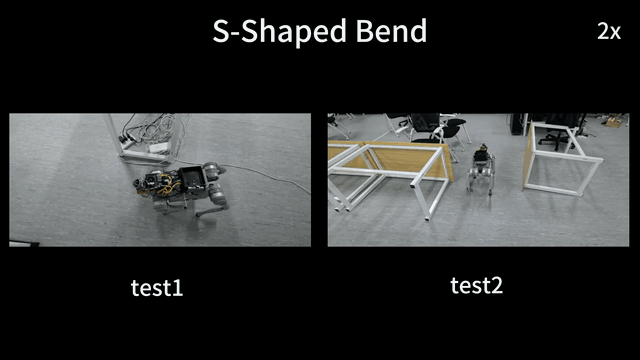

# SCAN-Planner

Code will be coming soon.

This local planner can support various upper-level tasks, such as autonomous exploration and vision-language navigation (VLN). For related work, please refer to [wuyi2121/TravExplorer](https://github.com/wuyi2121/TravExplorer).

## Demos

### 🏠 Cluttered room

### 🌀 S-shaped bend

### 🚧 Dynamic obstacle

### 🌈 Cross-floor long-range navigation

